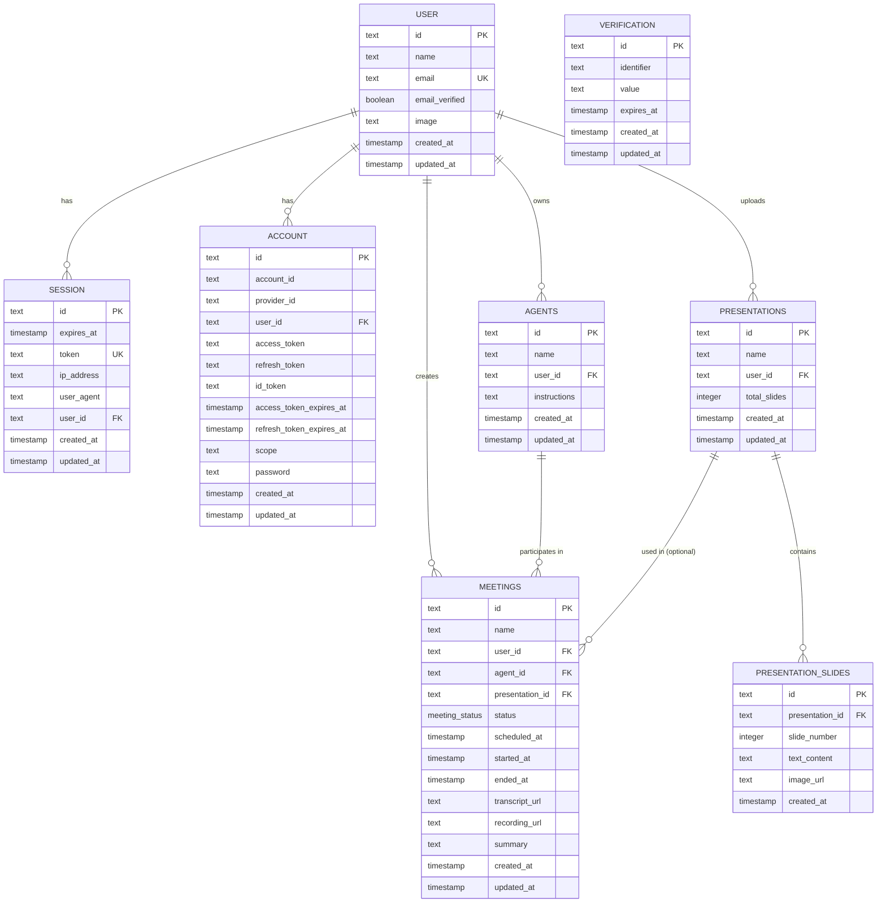
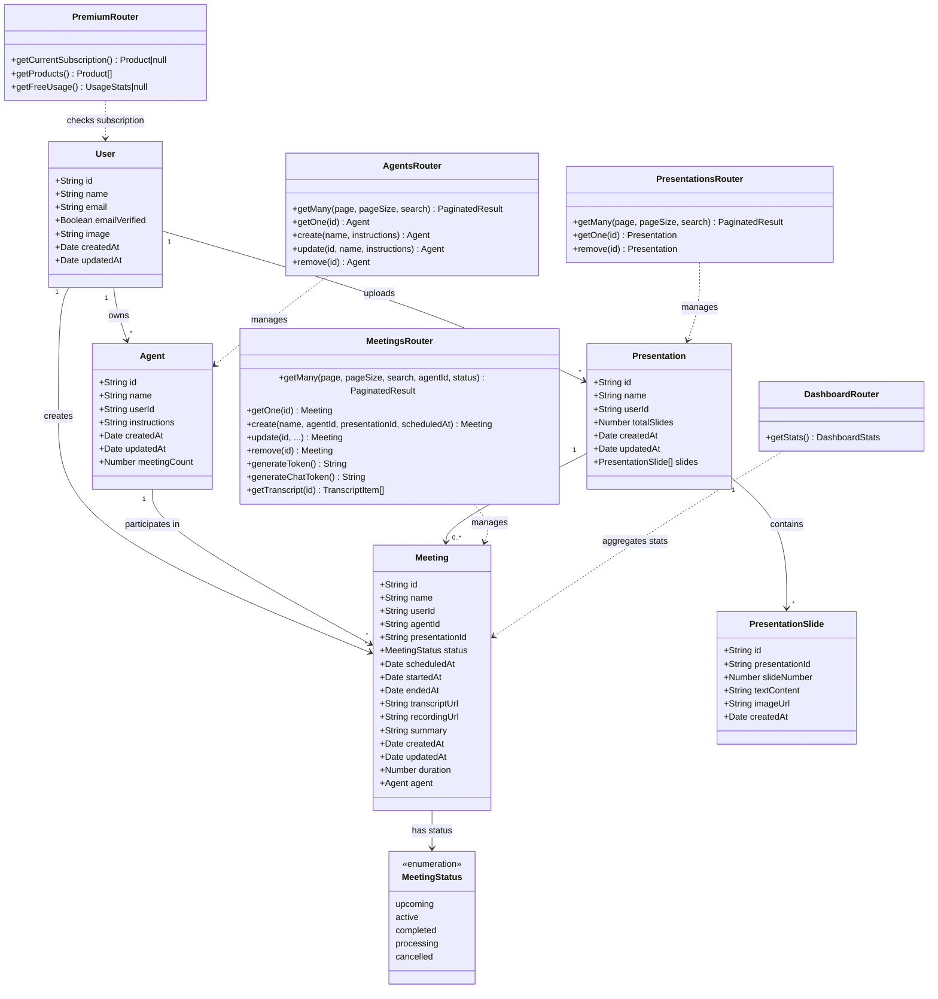

# Meet.AI — Codebase Schema & Architecture Reference

> **Purpose:** This document contains all Drizzle ORM schemas, tRPC routers/procedures, TypeScript types, Zod validation schemas, and business logic constants extracted directly from the codebase. Use this to create accurate **ER Diagrams** and **Class Diagrams**.

---

## 1. Drizzle ORM Schema

**File:** `src/db/schema.ts`

### 1.1 User (Better Auth — managed)

```typescript
export const user = pgTable("user", {
  id: text('id').primaryKey(),
  name: text('name').notNull(),
  email: text('email').notNull().unique(),
  emailVerified: boolean('email_verified').$defaultFn(() => false).notNull(),
  image: text('image'),
  createdAt: timestamp('created_at').$defaultFn(() => new Date()).notNull(),
  updatedAt: timestamp('updated_at').$defaultFn(() => new Date()).notNull()
});
```

### 1.2 Session (Better Auth — managed)

```typescript
export const session = pgTable("session", {
  id: text('id').primaryKey(),
  expiresAt: timestamp('expires_at').notNull(),
  token: text('token').notNull().unique(),
  createdAt: timestamp('created_at').notNull(),
  updatedAt: timestamp('updated_at').notNull(),
  ipAddress: text('ip_address'),
  userAgent: text('user_agent'),
  userId: text('user_id').notNull().references(() => user.id, { onDelete: 'cascade' })
});
```

### 1.3 Account (Better Auth — managed)

```typescript
export const account = pgTable("account", {
  id: text('id').primaryKey(),
  accountId: text('account_id').notNull(),
  providerId: text('provider_id').notNull(),
  userId: text('user_id').notNull().references(() => user.id, { onDelete: 'cascade' }),
  accessToken: text('access_token'),
  refreshToken: text('refresh_token'),
  idToken: text('id_token'),
  accessTokenExpiresAt: timestamp('access_token_expires_at'),
  refreshTokenExpiresAt: timestamp('refresh_token_expires_at'),
  scope: text('scope'),
  password: text('password'),
  createdAt: timestamp('created_at').notNull(),
  updatedAt: timestamp('updated_at').notNull()
});
```

### 1.4 Verification (Better Auth — managed)

```typescript
export const verification = pgTable("verification", {
  id: text('id').primaryKey(),
  identifier: text('identifier').notNull(),
  value: text('value').notNull(),
  expiresAt: timestamp('expires_at').notNull(),
  createdAt: timestamp('created_at').$defaultFn(() => new Date()),
  updatedAt: timestamp('updated_at').$defaultFn(() => new Date())
});
```

### 1.5 Agents

```typescript
export const agents = pgTable("agents", {
  id: text("id").primaryKey().$defaultFn(() => nanoid()),
  name: text("name").notNull(),
  userId: text("user_id").notNull().references(() => user.id, { onDelete: "cascade" }),
  instructions: text("instructions").notNull(),
  createdAt: timestamp("created_at").notNull().defaultNow(),
  updatedAt: timestamp("updated_at").notNull().defaultNow(),
});
```

### 1.6 Presentations

```typescript
export const presentations = pgTable("presentations", {
  id: text("id").primaryKey().$defaultFn(() => nanoid()),
  name: text("name").notNull(),
  userId: text("user_id").notNull().references(() => user.id, { onDelete: "cascade" }),
  totalSlides: integer("total_slides").notNull().default(0),
  createdAt: timestamp("created_at").notNull().defaultNow(),
  updatedAt: timestamp("updated_at").notNull().defaultNow(),
});
```

### 1.7 Presentation Slides

```typescript
export const presentationSlides = pgTable("presentation_slides", {
  id: text("id").primaryKey().$defaultFn(() => nanoid()),
  presentationId: text("presentation_id").notNull()
    .references(() => presentations.id, { onDelete: "cascade" }),
  slideNumber: integer("slide_number").notNull(),
  textContent: text("text_content").notNull().default(""),
  imageUrl: text("image_url"),
  createdAt: timestamp("created_at").notNull().defaultNow(),
});
```

### 1.8 Meetings

```typescript
export const meetingStatus = pgEnum("meeting_status", [
  "upcoming", "active", "completed", "processing", "cancelled"
]);

export const meetings = pgTable("meetings", {
  id: text("id").primaryKey().$defaultFn(() => nanoid()),
  name: text("name").notNull(),
  userId: text("user_id").notNull().references(() => user.id, { onDelete: "cascade" }),
  agentId: text("agent_id").notNull().references(() => agents.id, { onDelete: "cascade" }),
  presentationId: text("presentation_id")
    .references(() => presentations.id, { onDelete: "set null" }),
  status: meetingStatus("status").notNull().default("upcoming"),
  scheduledAt: timestamp("scheduled_at"),
  startedAt: timestamp("started_at"),
  endedAt: timestamp("ended_at"),
  transcriptUrl: text("transcript_url"),
  recordingUrl: text("recording_url"),
  summary: text("summary"),
  createdAt: timestamp("created_at").notNull().defaultNow(),
  updatedAt: timestamp("updated_at").notNull().defaultNow(),
});
```

---

## 2. Entity Relationships Summary

| Relationship | Type | FK Column | On Delete |
|---|---|---|---|
| User → Session | One-to-Many | `session.user_id` | CASCADE |
| User → Account | One-to-Many | `account.user_id` | CASCADE |
| User → Agent | One-to-Many | `agents.user_id` | CASCADE |
| User → Meeting | One-to-Many | `meetings.user_id` | CASCADE |
| User → Presentation | One-to-Many | `presentations.user_id` | CASCADE |
| Agent → Meeting | One-to-Many | `meetings.agent_id` | CASCADE |
| Presentation → Meeting | One-to-Many (optional) | `meetings.presentation_id` | SET NULL |
| Presentation → PresentationSlide | One-to-Many | `presentation_slides.presentation_id` | CASCADE |

---

## 3. Enums

### MeetingStatus (DB + TypeScript)

```typescript
// DB Enum (pgEnum)
export const meetingStatus = pgEnum("meeting_status", [
  "upcoming", "active", "completed", "processing", "cancelled"
]);

// TypeScript Enum (client-side)
export enum MeetingStatus {
  Upcoming = "upcoming",
  Active = "active",
  Completed = "completed",
  Processing = "processing",
  Cancelled = "cancelled",
}
```

---

## 4. Zod Validation Schemas

### 4.1 Agents (`src/modules/agents/schemas.ts`)

```typescript
export const agentsInsertSchema = z.object({
  name: z.string().min(1, { message: "Name is required" }),
  instructions: z.string().min(1, { message: "Instructions are required" }),
});

export const agentsUpdateSchema = agentsInsertSchema.extend({
  id: z.string().min(1, { message: "Id is required" }),
});
```

### 4.2 Meetings (`src/modules/meetings/schemas.ts`)

```typescript
export const meetingsInsertSchema = z.object({
  name: z.string().min(1, { message: "Name is required" }),
  agentId: z.string().min(1, { message: "Agent is required" }),
  presentationId: z.string().nullish(),
  scheduledAt: z.coerce.date().nullish(),
});

export const meetingsUpdateSchema = meetingsInsertSchema.extend({
  id: z.string().min(1, { message: "Id is required" }),
});
```

### 4.3 Presentations (`src/modules/presentations/schemas.ts`)

```typescript
export const presentationsInsertSchema = z.object({
  name: z.string().min(1, { message: "Name is required" }),
});

export const presentationsUpdateSchema = presentationsInsertSchema.extend({
  id: z.string().min(1, { message: "Id is required" }),
});
```

---

## 5. TypeScript Types

### 5.1 Agents (`src/modules/agents/types.ts`)

```typescript
export type AgentsGetMany = inferRouterOutputs<AppRouter>["agents"]["getMany"]["items"];
export type AgentGetOne = inferRouterOutputs<AppRouter>["agents"]["getOne"];
```

### 5.2 Meetings (`src/modules/meetings/types.ts`)

```typescript
export type MeetingGetMany = inferRouterOutputs<AppRouter>["meetings"]["getMany"]["items"];
export type MeetingGetOne = inferRouterOutputs<AppRouter>["meetings"]["getOne"];

export type StreamTranscriptItem = {
  speaker_id: string;
  type: string;
  text: string;
  start_ts: number;
  stop_ts: number;
};
```

### 5.3 Presentations (`src/modules/presentations/types.ts`)

```typescript
export type PresentationsGetMany = inferRouterOutputs<AppRouter>["presentations"]["getMany"]["items"];
export type PresentationGetOne = inferRouterOutputs<AppRouter>["presentations"]["getOne"];
```

---

## 6. Premium / Business Logic Constants

**File:** `src/modules/premium/constants.ts`

```typescript
export const MAX_FREE_MEETINGS = 3;
export const MAX_FREE_AGENTS = 1;
export const MAX_FREE_PRESENTATIONS = 1;
```

---

## 7. tRPC Router Structure

**File:** `src/trpc/routers/_app.ts`

```typescript
export const appRouter = createTRPCRouter({
  agents: agentsRouter,
  dashboard: dashboardRouter,
  meetings: meetingsRouter,
  premium: premiumRouter,
  presentations: presentationsRouter,
});
```

---

## 8. tRPC Middleware / Procedures

**File:** `src/trpc/init.ts`

### 8.1 protectedProcedure

Requires authenticated session via Better Auth. Adds `ctx.auth` (session + user).

### 8.2 premiumProcedure(entity)

Extends `protectedProcedure`. Checks Polar subscription status and enforces free-tier limits:
- `entity = "agents"` → Throws FORBIDDEN if `agentCount >= MAX_FREE_AGENTS` and not premium
- `entity = "meetings"` → Throws FORBIDDEN if `meetingCount >= MAX_FREE_MEETINGS` and not premium

---

## 9. tRPC Router Procedures (Methods)

### 9.1 agentsRouter (`src/modules/agents/server/procedures.ts`)

| Procedure | Type | Auth | Input | Description |
|---|---|---|---|---|
| `getMany` | query | protected | `{ page, pageSize, search? }` | Paginated list with meetingCount per agent |
| `getOne` | query | protected | `{ id }` | Single agent with meetingCount |
| `create` | mutation | **premium("agents")** | `{ name, instructions }` | Create agent (quota enforced) |
| `update` | mutation | protected | `{ id, name, instructions }` | Update agent |
| `remove` | mutation | protected | `{ id }` | Delete agent |

### 9.2 meetingsRouter (`src/modules/meetings/server/procedures.ts`)

| Procedure | Type | Auth | Input | Description |
|---|---|---|---|---|
| `getMany` | query | protected | `{ page, pageSize, search?, agentId?, status? }` | Paginated list with agent join + duration |
| `getOne` | query | protected | `{ id }` | Single meeting with agent join + duration |
| `create` | mutation | **premium("meetings")** | `{ name, agentId, presentationId?, scheduledAt? }` | Create meeting + Stream call + optional Inngest reminder |
| `update` | mutation | protected | `{ id, name, agentId, presentationId?, scheduledAt? }` | Update meeting |
| `remove` | mutation | protected | `{ id }` | Delete meeting |
| `generateToken` | mutation | protected | — | Generate Stream Video token (1hr expiry) |
| `generateChatToken` | mutation | protected | — | Generate Stream Chat token |
| `getTranscript` | query | protected | `{ id }` | Fetch & parse JSONL transcript with speaker info |

### 9.3 presentationsRouter (`src/modules/presentations/server/procedures.ts`)

| Procedure | Type | Auth | Input | Description |
|---|---|---|---|---|
| `getMany` | query | protected | `{ page, pageSize, search? }` | Paginated list |
| `getOne` | query | protected | `{ id }` | Single presentation with slides |
| `remove` | mutation | protected | `{ id }` | Delete presentation |

> **Note:** Presentation upload is handled via a separate REST API route at `src/app/api/presentations/upload/route.ts` (not a tRPC procedure). It also enforces `MAX_FREE_PRESENTATIONS` server-side.

### 9.4 premiumRouter (`src/modules/premium/server/procedures.ts`)

| Procedure | Type | Auth | Input | Description |
|---|---|---|---|---|
| `getCurrentSubscription` | query | protected | — | Get active Polar subscription product for current user |
| `getProducts` | query | protected | — | List Polar products (active, recurring, sorted by price) |
| `getFreeUsage` | query | protected | — | Returns `{ meetingCount, agentCount, presentationCount }` or `null` if premium |

### 9.5 dashboardRouter (`src/modules/home/server/procedures.ts`)

| Procedure | Type | Auth | Input | Description |
|---|---|---|---|---|
| `getStats` | query | protected | — | Returns totalMeetings, totalAgents, upcomingMeetings, completedMeetings, meetingsByStatus, meetingsByMonth (6mo chart), meetingsByAgent (top 5), recentMeetings (last 5) |

---

## 10. Background Jobs (Inngest)

**File:** `src/inngest/functions.ts`

| Function | Trigger Event | Description |
|---|---|---|
| `createSummarizer` | — | Agent-kit AI summarizer (called internally). Uses `openai("gpt-4o")` to generate meeting summary from transcript + optional slide context |
| `meetings/completed` | `meetings/completed` | On meeting end: fetches transcript, recording, calls AI summarizer, updates meeting record with `summary`, `transcriptUrl`, `recordingUrl`, sets status to `"completed"`, sends summary email via Resend |
| `meetings/reminder` | `meetings/reminder` | 15 minutes before `scheduledAt`: sends reminder email via Resend |

---

## 11. External Services Integration

| Service | SDK | Purpose |
|---|---|---|
| **Neon** (PostgreSQL) | `@neondatabase/serverless` | Serverless Postgres database |
| **Better Auth** | `better-auth` | Authentication (email, Google, GitHub) |
| **Polar** | `@polar-sh/sdk` | Subscription billing (sandbox mode) |
| **Stream Video** | `@stream-io/video-react-sdk` + `@stream-io/node-sdk` | Video calls, transcription, recording |
| **Stream Chat** | `stream-chat` + `stream-chat-react` | In-meeting chat |
| **OpenAI** | `openai` + `@inngest/agent-kit` | AI meeting summarization (GPT-4o) |
| **Inngest** | `inngest` | Background job orchestration |
| **Resend** | `resend` | Transactional emails (summaries, reminders) |

---

## 12. ER Diagram (Mermaid)



---

## 13. Class Diagram (Mermaid)


