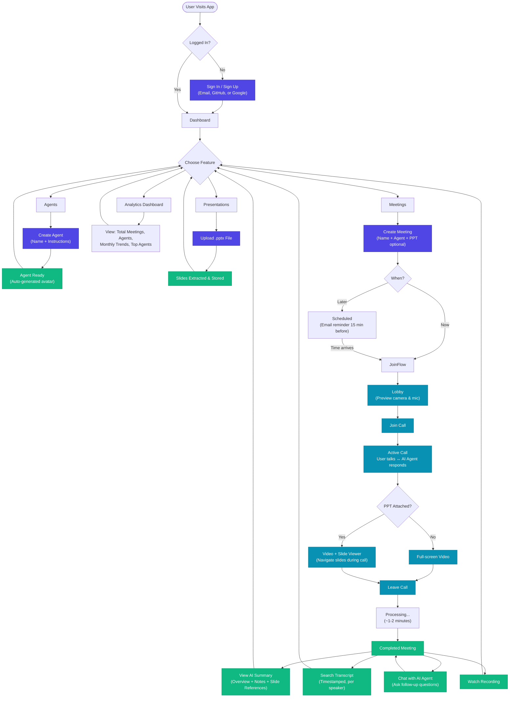

# AgentDesk — User Flow

```mermaid
flowchart TD
    Start([User Visits App]) --> Auth{Logged In?}
    Auth -->|No| SignIn["Sign In / Sign Up\n(Email, GitHub, or Google)"]
    SignIn --> Dashboard
    Auth -->|Yes| Dashboard

    Dashboard[Dashboard] --> Feature{Choose Feature}

    Feature --> Agents[Agents]
    Feature --> Presentations[Presentations]
    Feature --> Meetings[Meetings]
    Feature --> Analytics[Analytics Dashboard]

    %% ===== AGENTS =====
    Agents --> CreateAgent["Create Agent\n(Name + Instructions)"]
    CreateAgent --> AgentReady["Agent Ready\n(Auto-generated avatar)"]
    AgentReady --> Feature

    %% ===== PRESENTATIONS =====
    Presentations --> UploadPPT["Upload .pptx File"]
    UploadPPT --> PPTReady["Slides Extracted & Stored"]
    PPTReady --> Feature

    %% ===== ANALYTICS =====
    Analytics --> ViewStats["View: Total Meetings, Agents,\nMonthly Trends, Top Agents"]
    ViewStats --> Feature

    %% ===== MEETINGS =====
    Meetings --> CreateMeeting["Create Meeting\n(Name + Agent + PPT optional)"]
    CreateMeeting --> Schedule{When?}
    Schedule -->|Now| JoinFlow
    Schedule -->|Later| Scheduled["Scheduled\n(Email reminder 15 min before)"]
    Scheduled -->|Time arrives| JoinFlow

    %% ===== CALL FLOW =====
    JoinFlow --> Lobby["Lobby\n(Preview camera & mic)"]
    Lobby --> JoinCall["Join Call"]

    JoinCall --> ActiveCall["Active Call\nUser talks ↔ AI Agent responds"]
    ActiveCall --> HasSlides{PPT Attached?}
    HasSlides -->|No| VideoOnly["Full-screen Video"]
    HasSlides -->|Yes| SideBySide["Video + Slide Viewer\n(Navigate slides during call)"]

    VideoOnly --> LeaveCall
    SideBySide --> LeaveCall
    LeaveCall[Leave Call] --> Processing["Processing...\n(~1-2 minutes)"]

    %% ===== POST-CALL =====
    Processing --> CompletedMeeting["Completed Meeting"]
    CompletedMeeting --> ViewSummary["View AI Summary\n(Overview + Notes + Slide References)"]
    CompletedMeeting --> ViewTranscript["Search Transcript\n(Timestamped, per speaker)"]
    CompletedMeeting --> ViewRecording["Watch Recording"]
    CompletedMeeting --> ChatAI["Chat with AI Agent\n(Ask follow-up questions)"]

    ChatAI --> CompletedMeeting
    ViewSummary --> Feature
    ViewTranscript --> Feature
    ViewRecording --> Feature

    %% ===== STYLING =====
    classDef action fill:#4f46e5,stroke:#3730a3,color:#fff
    classDef videocall fill:#0891b2,stroke:#0e7490,color:#fff
    classDef result fill:#10b981,stroke:#059669,color:#fff

    class SignIn,CreateAgent,UploadPPT,CreateMeeting action
    class Lobby,JoinCall,ActiveCall,VideoOnly,SideBySide,LeaveCall videocall
    class AgentReady,PPTReady,CompletedMeeting,ViewSummary,ViewTranscript,ViewRecording,ChatAI result
```
