# AgentDesk - AI-Powered Meeting Intelligence Platform

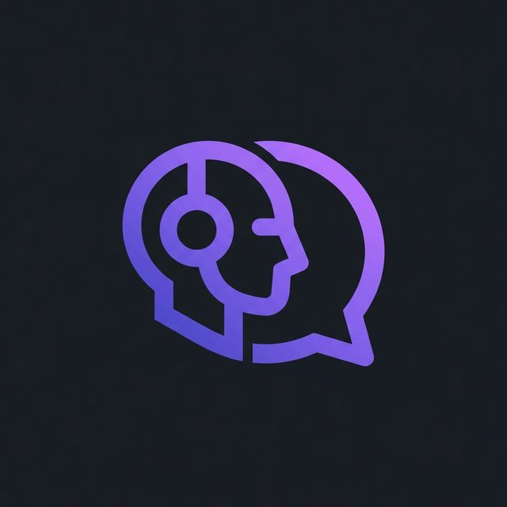

> Revolutionize your meetings with AI-powered agents, automatic transcription, intelligent summaries, and smart presentation integration.

## 📋 Table of Contents

- [Overview](#-overview)
- [Key Features](#-key-features)
- [Tech Stack](#-tech-stack)
- [Project Structure](#-project-structure)
- [Getting Started](#-getting-started)
- [Development Guide](#-development-guide)
- [Architecture](#-architecture)
- [API Documentation](#-api-documentation)
- [Database Schema](#-database-schema)
- [Screenshots & UI References](#-screenshots--ui-references)
- [Background Jobs (Inngest)](#-background-jobs-inngest)
- [Contributing](#-contributing)
- [License](#-license)

---

## 🎯 Overview

**AgentDesk** is a next-generation AI-powered video meeting application designed to enhance collaboration and productivity. It combines real-time video communication with intelligent AI agents that participate in your meetings, automatically record and transcribe conversations, generate comprehensive summaries, and intelligently connect discussion topics to your presentations.

Built with cutting-edge technologies including Next.js 15, React 19, and Stream.io for real-time communication, AgentDesk delivers a seamless experience for modern teams looking to extract maximum value from every meeting.

### Use Cases

- 📹 **Client Demos & Sales Calls**: AI agents record, transcribe, and summarize client interactions
- 📊 **Team Meetings**: Generate instant meeting minutes with action items and key decisions
- 👥 **Interviews & Recruitment**: Automated interview transcription and candidate evaluation
- 🎓 **Training Sessions**: Recorded training with indexed transcripts for future reference
- 📈 **Product Presentations**: Connect sales presentations with meeting discussions automatically

---

## ✨ Key Features

### 🤖 AI-Powered Agents
- **Custom Agent Creation**: Define custom AI agents with specific instructions and personalities
- **Real-time Participation**: AI agents actively participate in meetings, asking questions and taking notes
- **Intelligent Note-Taking**: Automatic capture of key points, action items, and decisions
- **Voice Integration**: Natural language processing with OpenAI and Inngest Agent Kit

### 📹 Real-Time Communication
- **Stream Video Integration**: High-quality video calls with sub-second latency
- **Live Chat**: Real-time text communication during calls
- **Screen Sharing**: Share presentations and screens with participants
- **Multiple Participants**: Support for group meetings with multiple attendees

### 📝 Automatic Meeting Intelligence
- **AI Transcription**: Real-time transcription of all meeting conversations
- **Smart Summaries**: Intelligent AI-generated meeting summaries with key takeaways
- **Action Items Extraction**: Automatic identification of tasks and responsibilities
- **Recording & Playback**: Full meeting recordings with indexed playback

### 🎤 Transcript & Search
- **Full-Text Search**: Search through meeting transcripts with timestamp references
- **Timestamp Navigation**: Jump to specific moments in meeting recordings
- **Exportable Transcripts**: Download transcripts in multiple formats
- **Speaker Identification**: Identify who said what in each meeting

### 📊 Presentation Integration
- **PPT File Upload**: Upload PowerPoint presentations for meeting context
- **Automatic Slide Parsing**: Extract text and images from slides
- **Slide Mapping**: Automatically map discussion topics to relevant slides
- **Visual Reference**: Display current slide during meetings for context

### 💳 Subscription Management
- **Tiered Plans**: Multiple subscription tiers with different feature sets
- **Polar Integration**: Seamless payment processing and billing via `@polar-sh/better-auth`
- **Usage Tracking**: Monitor meeting minutes, recording hours, and API usage
- **Flexible Billing**: Monthly and annual subscription options

### 🔐 Authentication & Security
- **Better Auth Integration**: Modern, secure authentication system
- **OAuth Support**: Sign in with popular providers (Google, GitHub, etc.)
- **Email Verification**: Secure email verification for new accounts
- **Session Management**: Automatic session handling with security best practices
- **Access Control**: Role-based access control for team members

### 📱 Responsive Design
- **Mobile-First Approach**: Fully responsive UI that works on desktop, tablet, and mobile
- **Dark Mode**: Automatic theme detection and toggle support
- **Touch-Optimized**: Intuitive touch interactions for mobile users
- **Progressive Web App**: Offline support and installable PWA

### ⚙️ Background Processing
- **Asynchronous Jobs**: Inngest-powered background job queue
- **Meeting Processing**: Automatic processing after meeting completion
- **Email Notifications**: Transactional emails via Resend
- **Scheduled Tasks**: Automated maintenance and cleanup tasks

---

## 🛠️ Tech Stack

### Frontend
| Technology | Purpose | Version |
|------------|---------|---------|
| **Next.js** | Full-stack React framework | 15.3.2 |
| **React** | UI library | 19.0.0 |
| **TypeScript** | Type-safe JavaScript | ^5.9.3 |
| **Tailwind CSS** | Utility-first CSS framework | v4 |
| **Shadcn/ui** | High-quality React components | Latest |
| **TanStack React Query** | Data fetching & caching | 5.76.1 |
| **TanStack React Table** | Headless table library | 8.21.3 |
| **React Hook Form** | Form state management | 7.56.4 |
| **Zod** | TypeScript-first schema validation | 4.0.0 |

### Backend & API
| Technology | Purpose | Version |
|------------|---------|---------|
| **tRPC** | End-to-end typesafe API | 11.1.2 |
| **Node.js** | Runtime environment | Latest LTS |
| **OpenAI** | AI and language models | 4.103.0 |
| **Inngest Agent Kit** | AI agent framework | 0.13.2 |

### Database
| Technology | Purpose | Version |
|------------|---------|---------|
| **Drizzle ORM** | Type-safe ORM | 0.43.1 |
| **PostgreSQL (Neon)** | Primary database | Latest |
| **Neon Serverless** | Serverless Postgres client | 1.0.0 |

### Real-Time Communication
| Technology | Purpose | Version |
|------------|---------|---------|
| **Stream Video SDK** | Video calling | 1.18.0 |
| **Stream Chat SDK** | Real-time chat | 9.1.1 |
| **Stream Node SDK** | Backend integration | 0.7.59 |

### Authentication & Payments
| Technology | Purpose | Version |
|------------|---------|---------|
| **Better Auth** | Modern auth solution | 1.2.8 |
| **Polar SDK** | Payment processing | 0.32.16 |

### Background Jobs & Email
| Technology | Purpose | Version |
|------------|---------|---------|
| **Inngest** | Background job queue | 3.54.2 |
| **Resend** | Transactional emails | 6.9.3 |

### Development & Testing
| Technology | Purpose | Version |
|------------|---------|---------|
| **Vitest** | Unit testing framework | Latest |
| **ESLint** | Code linting | Latest |
| **Drizzle Kit** | ORM migrations | Latest |

---

## 📁 Project Structure

```
agentdesk/
├── src/
│   ├── app/                          # Next.js app directory
│   │   ├── (auth)/                   # Authentication routes (sign-in, sign-up)
│   │   ├── (dashboard)/              # Dashboard routes
│   │   │   ├── agents/               # Agent management pages
│   │   │   ├── dashboard/            # Dashboard main view
│   │   │   ├── meetings/             # Meeting list & details
│   │   │   ├── presentations/        # Presentation management
│   │   │   └── upgrade/              # Subscription upgrade page
│   │   ├── (landing)/                # Public landing page
│   │   ├── api/                      # API routes (webhooks, auth, slide uploads)
│   │   │   ├── auth/                 # Better Auth handler
│   │   │   ├── inngest/              # Inngest endpoint
│   │   │   ├── presentations/        # Presentation upload endpoint
│   │   │   ├── trpc/                 # tRPC endpoint
│   │   │   └── webhook/              # Webhook listeners
│   │   ├── call/                     # Video call room layout & dynamic page
│   │   ├── layout.tsx                # Root layout
│   │   └── globals.css               # Global styles
│   │
│   ├── components/                   # Reusable React components
│   │   ├── ui/                       # Shadcn/ui components
│   │   ├── command-select.tsx        # Custom select/autocomplete
│   │   ├── data-table.tsx            # Advanced data table
│   │   ├── data-pagination.tsx       # Pagination component
│   │   ├── responsive-dialog.tsx     # Dialog component
│   │   ├── loading-state.tsx         # Loading skeleton
│   │   ├── error-state.tsx           # Error fallback
│   │   ├── empty-state.tsx           # Empty state UI
│   │   └── generated-avatar.tsx      # Dicebear-based avatar component
│   │
│   ├── modules/                      # Feature modules
│   │   ├── agents/                   # Agent feature (UI, hooks, schemas)
│   │   │   ├── server/               # Server-side procedures
│   │   │   └── ui/                   # Agent components and forms
│   │   ├── auth/                     # Authentication module
│   │   ├── call/                     # Video call interface with Stream Video
│   │   ├── dashboard/                # Dashboard overview module
│   │   ├── home/                     # Home page and landing module
│   │   ├── meetings/                 # Meeting management module
│   │   ├── presentations/            # PowerPoint parsing and layout module
│   │   └── premium/                  # Premium subscription tier checks and components
│   │
│   ├── trpc/                         # tRPC configuration
│   │   ├── routers/                  # API routers
│   │   │   └── _app.ts               # Main router combining all modules
│   │   ├── init.ts                   # tRPC initialization (middleware, procedure contexts)
│   │   ├── server.tsx                # Server-side caller
│   │   ├── client.tsx                # Client-side TRPCReactProvider
│   │   └── query-client.ts           # React Query setup
│   │
│   ├── db/                           # Database layer
│   │   ├── schema.ts                 # Drizzle schema definitions
│   │   └── index.ts                  # Neon Serverless database client
│   │
│   ├── lib/                          # Utility functions & clients
│   │   ├── auth.ts                   # Better Auth server configuration
│   │   ├── auth-client.ts            # Better Auth client configuration
│   │   ├── stream-video.ts           # Stream Video server-side client
│   │   ├── stream-chat.ts            # Stream Chat server-side client
│   │   ├── polar.ts                  # Polar client setup
│   │   ├── resend.ts                 # Resend client setup
│   │   ├── avatar.tsx                # Avatar URL generator utility
│   │   └── utils.ts                  # Tailwind merge and styling utilities
│   │
│   ├── inngest/                      # Background job processing
│   │   ├── functions.ts              # Job definitions (Whisper transcriber, GPT summarizer)
│   │   ├── client.ts                 # Inngest client
│   │   └── index.ts                  # Exports
│   │
│   ├── hooks/                        # Global custom hooks
│   │   ├── use-mobile.ts             # Mobile viewport detector hook
│   │   └── use-confirm.tsx           # Context-based confirmation dialog hook
│   │
│   ├── constants.ts                  # Global constants (pagination sizes, limits)
│   └── test/                         # Test setup
│
├── public/                           # Static assets
├── coverage/                         # Test coverage reports
├── node_modules/                     # Dependencies
├── drizzle.config.ts                 # Drizzle ORM config
├── next.config.ts                    # Next.js config
├── tsconfig.json                     # TypeScript config
├── vitest.config.ts                  # Vitest config
├── components.json                   # Shadcn/ui config
├── package.json                      # Dependencies & scripts
├── postcss.config.mjs                # PostCSS config
├── eslint.config.mjs                 # ESLint config
└── README.md                         # This file
```

---

## 🚀 Getting Started

### Prerequisites

- **Node.js**: v18 or higher
- **npm** or **yarn**: Package manager
- **PostgreSQL Database**: Neon or self-hosted
- **Git**: Version control

### Environment Variables

Create a `.env.local` file in the project root with the following variables:

```env
# Database
DATABASE_URL=postgresql://[user]:[password]@[host]/[database]?sslmode=require

# Authentication (Better Auth)
BETTER_AUTH_SECRET=your_secret_key_here
BETTER_AUTH_URL=http://localhost:3000

# OAuth Providers (Optional)
GOOGLE_CLIENT_ID=your_google_client_id
GOOGLE_CLIENT_SECRET=your_google_client_secret
GITHUB_CLIENT_ID=your_github_client_id
GITHUB_CLIENT_SECRET=your_github_client_secret

# Stream.io Video & Chat
NEXT_PUBLIC_STREAM_API_KEY=your_stream_api_key
STREAM_SECRET=your_stream_secret
STREAM_APP_ID=your_stream_app_id

# OpenAI & Inngest
OPENAI_API_KEY=your_openai_api_key
INNGEST_EVENT_KEY=your_inngest_event_key
INNGEST_DEV_SERVER=http://localhost:8288

# Polar (Payments)
POLAR_API_KEY=your_polar_api_key
POLAR_ORG_ID=your_polar_org_id

# Resend (Email)
RESEND_API_KEY=your_resend_api_key

# ngrok (Development)
NGROK_AUTHTOKEN=your_ngrok_auth_token (for webhooks)
```

### Installation

1. **Clone the repository**

```bash
git clone https://github.com/yourusername/agentdesk.git
cd agentdesk
```

2. **Install dependencies**

```bash
# Use --legacy-peer-deps for React 19 compatibility
npm install --legacy-peer-deps
```

3. **Setup database**

```bash
# Push schema to database
npm run db:push

# View database in studio (optional)
npm run db:studio
```

4. **Start development servers**

```bash
# Terminal 1: Next.js development server
npm run dev

# Terminal 2: Inngest development server (in new terminal)
npx inngest-cli@latest dev

# Terminal 3: ngrok webhook tunnel (optional, in new terminal)
npm run dev:webhook
```

5. **Access the application**

Open your browser and navigate to `http://localhost:3000`

---

## 🔧 Development Guide

### Available Commands

```bash
# Development
npm run dev              # Start Next.js dev server (http://localhost:3000)
npm run dev:webhook     # Start ngrok tunnel for webhooks (configured for hardcoded dev URL)

# Building
npm run build            # Build for production
npm start                # Start production server

# Database
npm run db:push         # Push schema changes to database
npm run db:studio       # Open Drizzle Studio (http://localhost:5555)

# Testing
npm test                # Run tests once via Vitest
npm run test:watch      # Run tests in watch mode
npm run test:coverage   # Generate coverage report

# Linting & Type Checking
npm run lint            # Run ESLint
npx tsc --noEmit        # Run TypeScript type checking
```

### Project Configuration Files

#### `tsconfig.json`
- TypeScript configuration with path aliases (`@/*` → `src/*`)
- Strict mode enabled
- Next.js compatibility

#### `next.config.ts`
- External packages for WebSocket support
- Configured for production optimization

#### `drizzle.config.ts`
- Database connection via `DATABASE_URL`
- Migration tracking
- Type generation

#### `vitest.config.ts`
- Unit testing framework
- Coverage reporting
- React Testing Library integration

#### `components.json`
- Shadcn/ui component configuration
- Component aliases and styles setup

### Code Style & Conventions

- **TypeScript**: All code should be strictly typed
- **React**: Functional components with hooks
- **File Naming**: 
  - Components: PascalCase (`MyComponent.tsx`)
  - Utilities & Hooks: camelCase (`myUtil.ts`, `useMyHook.ts`)
  - Schemas: `schemas.ts` for Zod definitions
- **Folder Organization**: Feature-based module structure
- **Error Handling**: Try-catch with meaningful error messages and custom boundary fallbacks
- **Comments**: JSDoc for complex functions

---

## 🏗️ Architecture

### System Architecture

```
┌─────────────────────────────────────────────────────────────┐
│                     Web Browser                              │
└─────────────────────────────────────────────────────────────┘
                           │
                     HTTP/WebSocket
                           │
┌─────────────────────────────────────────────────────────────┐
│                    Next.js Frontend                          │
│  (React 19, Tailwind, Shadcn/ui, TanStack Query)           │
└─────────────────────────────────────────────────────────────┘
                           │
             ┌─────────────┼─────────────┐
             │             │             │
         tRPC API      Stream.io      Auth Client
             │             │             │
┌───────────────────────────────────────────────────────────────────┐
│                   Next.js Backend                                 │
│  ┌─────────────────────────────────────────────────────────┐    │
│  │ tRPC Routers (agents, meetings, presentations, etc)    │    │
│  └─────────────────────────────────────────────────────────┘    │
│  ┌─────────────────────────────────────────────────────────┐    │
│  │ Server Actions & API Routes                             │    │
│  └─────────────────────────────────────────────────────────┘    │
└───────────────────────────────────────────────────────────────────┘
             │               │                    │
             │               │                    │
       Stream.io          Inngest           PostgreSQL
    (Video & Chat)   (Background Jobs)    (Neon Database)
             │               │                    │
             └───────────────┼────────────────────┘
                             │
             ┌───────────────┼───────────────┐
             │               │               │
         OpenAI         Polar Invoice      Resend Email
          (AI)          (Payments)         (Marketing)
```

### Data Flow

1. **User Authentication**
   - User signs in via Better Auth (supported by social providers or credentials)
   - Session token stored in cookie
   - Protected routes verified on server using `auth.api.getSession`

2. **Meeting Creation**
   - User creates meeting with agent & presentation
   - Data stored in PostgreSQL via Drizzle ORM
   - Stream.io room token and call structure generated

3. **Real-Time Meeting**
   - WebSocket connection to Stream.io for video and chat
   - Live stream processed with automatic transcription and recording
   - Voice agent communicates with OpenAI Realtime API

4. **Post-Meeting Processing**
   - Inngest job triggered on meeting end event (`meetings/ended`)
   - Transcript file fetched, structured, and saved
   - AI Summary generated with key takeaways and slide mapping
   - Email notification sent using Resend

---

## 📡 API Documentation

### tRPC Routers

#### Agents Router (`agents.*`)

```typescript
// List user's agents (paginated and searchable)
agents.getMany({
  page?: number,
  pageSize?: number,
  search?: string
}) => Promise<{ items: Agent[], total: number, totalPages: number }>

// Create new agent
agents.create({
  name: string,
  instructions: string
}) => Promise<Agent>

// Update agent
agents.update({
  id: string,
  name?: string,
  instructions?: string
}) => Promise<Agent>

// Delete agent
agents.remove({ id: string }) => Promise<Agent>

// Get agent details by ID
agents.getOne({ id: string }) => Promise<Agent & { meetingCount: number }>
```

#### Meetings Router (`meetings.*`)

```typescript
// List user's meetings (paginated, filterable by status or agent)
meetings.getMany({
  page?: number,
  pageSize?: number,
  search?: string,
  agentId?: string,
  status?: "upcoming" | "active" | "completed" | "processing" | "cancelled"
}) => Promise<{ items: Meeting[], total: number, totalPages: number }>

// Create meeting and register Call on Stream.io
meetings.create({
  name: string,
  agentId: string,
  presentationId?: string,
  scheduledAt?: Date
}) => Promise<Meeting>

// Generate Stream Video Client token
meetings.generateToken() => Promise<string>

// Generate Stream Chat token
meetings.generateChatToken() => Promise<string>

// Update meeting properties (e.g. status, urls)
meetings.update({
  id: string,
  name?: string,
  status?: string,
  startedAt?: Date,
  endedAt?: Date,
  transcriptUrl?: string,
  recordingUrl?: string,
  summary?: string
}) => Promise<Meeting>

// Delete meeting record
meetings.remove({ id: string }) => Promise<Meeting>

// Get meeting details and agent information
meetings.getOne({ id: string }) => Promise<Meeting & { agent: Agent, duration: number }>

// Fetch meeting transcript items mapped to speakers (users/agents)
meetings.getTranscript({ id: string }) => Promise<StreamTranscriptItem[]>
```

#### Presentations Router (`presentations.*`)

```typescript
// List user's presentations (paginated and searchable)
presentations.getMany({
  page?: number,
  pageSize?: number,
  search?: string
}) => Promise<{ items: Presentation[], total: number, totalPages: number }>

// Get presentation details and its parsed slide deck
presentations.getOne({ id: string }) => Promise<Presentation & { slides: PresentationSlide[] }>

// Delete presentation
presentations.remove({ id: string }) => Promise<Presentation>
```

#### Dashboard Router (`dashboard.*`)

```typescript
// Get dashboard statistics and recent activities
dashboard.getStats() => Promise<{
  totalMeetings: number,
  totalAgents: number,
  upcomingMeetings: number,
  completedMeetings: number,
  meetingsByStatus: { status: string, count: number }[],
  meetingsByMonth: { month: string, count: number }[],
  meetingsByAgent: { agentName: string, count: number }[],
  recentMeetings: { id: string, name: string, status: string, createdAt: Date, scheduledAt?: Date | null, agentName: string }[]
}>
```

#### Premium Router (`premium.*`)

```typescript
// Get current subscription product info
premium.getCurrentSubscription() => Promise<Product | null>

// Get all active plans/products available in Polar
premium.getProducts() => Promise<Product[]>

// Get resource usage counts for free tiers
premium.getFreeUsage() => Promise<{
  meetingCount: number,
  agentCount: number,
  presentationCount: number,
} | null>
```

### HTTP Endpoints

#### Upload Presentation
*   **Endpoint**: `POST /api/presentations/upload`
*   **Content-Type**: `multipart/form-data`
*   **Request Params**:
    *   `file`: The `.pptx` PowerPoint file.
    *   `name` (optional): The presentation name.
*   **Response**:
    ```json
    {
      "id": "presentation_id",
      "name": "Presentation Name",
      "totalSlides": 12
    }
    ```

#### Subscription Checkouts & Billing Portal
Subscriptions are handled client-side using `@polar-sh/better-auth`'s polar client plugin:
*   **Checkout Session**: `authClient.checkout({ products: [productId] })`
*   **Billing Portal**: `authClient.customer.portal()`

---

## 🗄️ Database Schema

### User Management

**user** table
- `id` (Text, Primary Key): Unique user identifier
- `name` (Text): User's name
- `email` (Text, Unique): User's email address
- `emailVerified` (Boolean): Verification status
- `image` (Text, Optional): User's profile picture
- `createdAt` (Timestamp): Account creation date
- `updatedAt` (Timestamp): Last update timestamp

**session** table
- `id` (Text, Primary Key): Session identifier
- `expiresAt` (Timestamp): Session expiration time
- `token` (Text, Unique): Session token
- `userId` (Text, FK): Reference to user.id
- `ipAddress` (Text): User's IP address
- `userAgent` (Text): Browser user agent
- `createdAt` (Timestamp): Creation date
- `updatedAt` (Timestamp): Last update

**account** table (OAuth & credentials)
- `id` (Text, Primary Key)
- `userId` (Text, FK): Reference to user.id
- `accountId` (Text): External account ID
- `providerId` (Text): OAuth provider name
- `accessToken` (Text, Optional)
- `refreshToken` (Text, Optional)
- `idToken` (Text, Optional)
- `accessTokenExpiresAt` (Timestamp, Optional)
- `refreshTokenExpiresAt` (Timestamp, Optional)
- `scope` (Text, Optional)
- `password` (Text, Optional)
- `createdAt` (Timestamp): Creation date
- `updatedAt` (Timestamp): Last update

**verification** table (Email verification)
- `id` (Text, Primary Key)
- `identifier` (Text): Email address
- `value` (Text): Verification token/code
- `expiresAt` (Timestamp): Expiration date
- `createdAt` (Timestamp): Creation date
- `updatedAt` (Timestamp): Last update

### Agents & AI

**agents** table
- `id` (Text, Primary Key): Agent identifier
- `name` (Text): Agent name
- `userId` (Text, FK): Owner of the agent (user.id)
- `instructions` (Text): Agent behavior & system instructions
- `createdAt` (Timestamp): Creation date
- `updatedAt` (Timestamp): Last update

### Meetings

**meetings** table
- `id` (Text, Primary Key): Meeting identifier
- `name` (Text): Meeting title
- `userId` (Text, FK): Organizer (user.id)
- `agentId` (Text, FK): Assigned AI agent (agents.id)
- `presentationId` (Text, FK, Optional): Associated presentation (presentations.id)
- `status` (Enum: `upcoming`, `active`, `completed`, `processing`, `cancelled`): Current state of the call
- `scheduledAt` (Timestamp, Optional): Scheduled date and time
- `startedAt` (Timestamp, Optional): Meeting start time
- `endedAt` (Timestamp, Optional): Meeting end time
- `transcriptUrl` (Text, Optional): JSONL file URL containing transcript
- `recordingUrl` (Text, Optional): Recording file URL
- `summary` (Text, Optional): AI-generated summary
- `createdAt` (Timestamp): Creation date
- `updatedAt` (Timestamp): Last update

### Presentations

**presentations** table
- `id` (Text, Primary Key): Presentation identifier
- `name` (Text): Presentation title
- `userId` (Text, FK): Reference to user.id
- `totalSlides` (Integer): Total slides parsed
- `createdAt` (Timestamp): Upload timestamp
- `updatedAt` (Timestamp): Last update

**presentation_slides** table
- `id` (Text, Primary Key): Slide identifier
- `presentationId` (Text, FK): Parent presentation.id
- `slideNumber` (Integer): Page number
- `textContent` (Text): Extracted slide content
- `imageUrl` (Text, Optional): Slide image/thumbnail
- `createdAt` (Timestamp): Creation timestamp

---

## 📸 Screenshots & UI References

### Landing Page

*Welcome screen with feature highlights and CTA buttons*

### Dashboard Overview
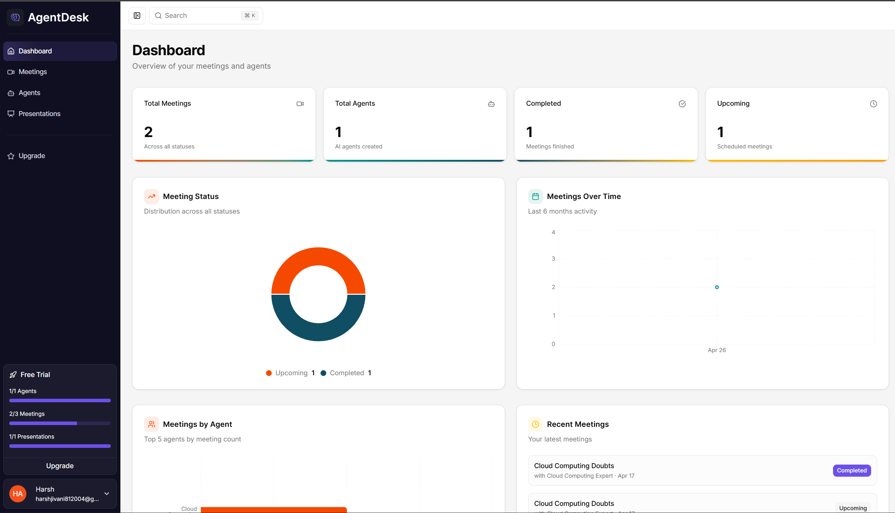
*Main dashboard showing recent meetings, statistics, and quick actions*

### Agent Management
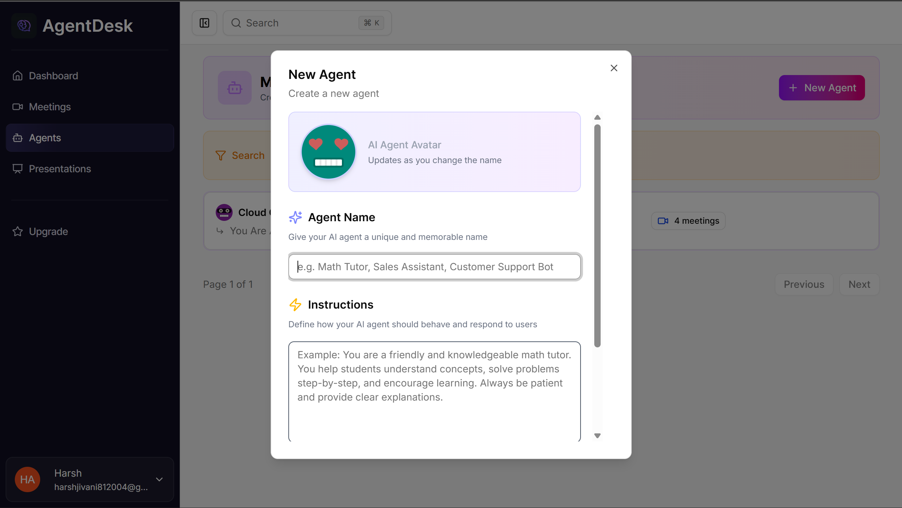
*Create and configure custom AI agents with instructions*

### Meeting Management

*Create and configure custom meetings with agents that you want to interact with.*

### Video Call Interface
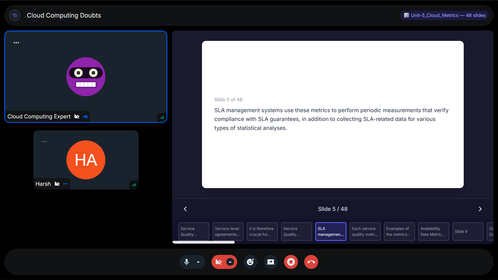
*Real-time video call with agent, chat, and presentation display*

### Meeting Transcript
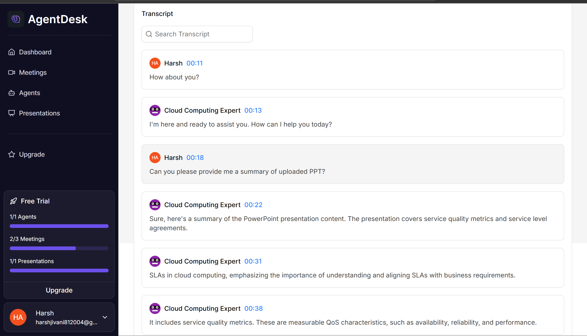
*Full transcript with search, timestamps, and speaker identification*

### Meeting Summary
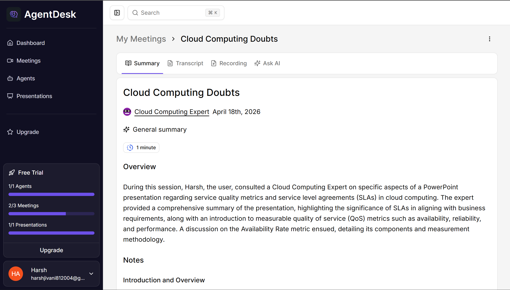
*Automatic AI-generated meeting summary with key points and action items*

### Presentation Upload
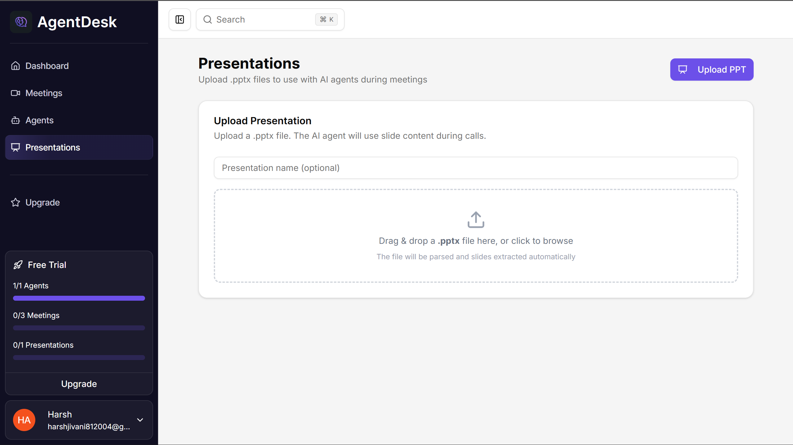
*Upload and manage PowerPoint presentations for meetings*

### Subscription Plans
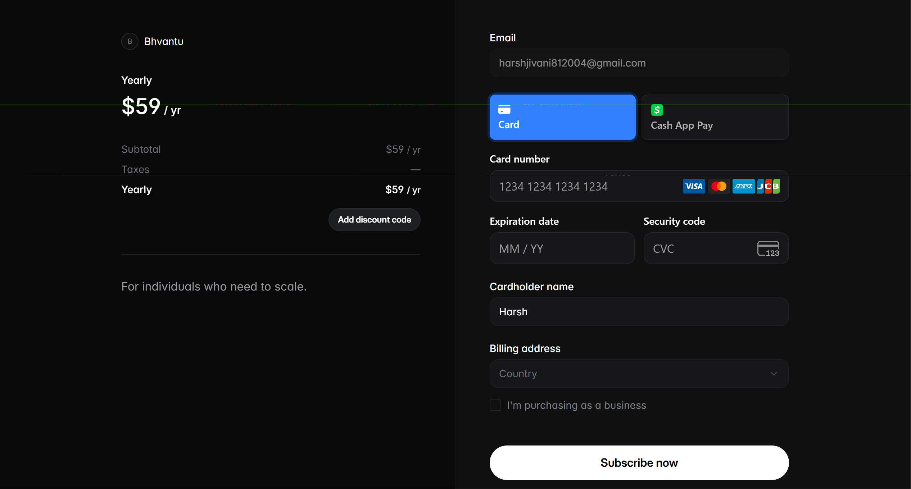
*Tiered subscription plans with feature comparison*

### Recording
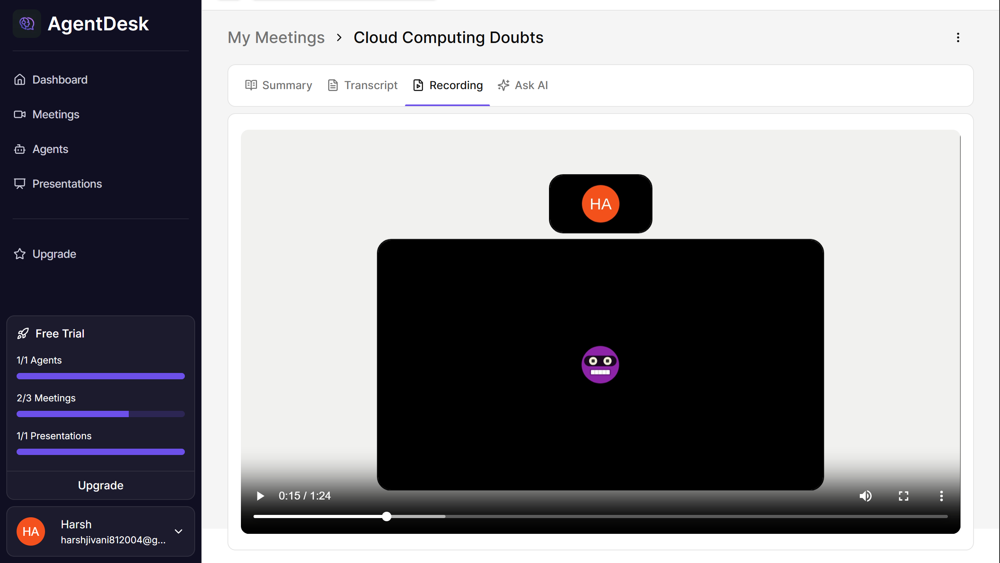
*User can watch whole meeting recording once meeting is over.*

### Reminder
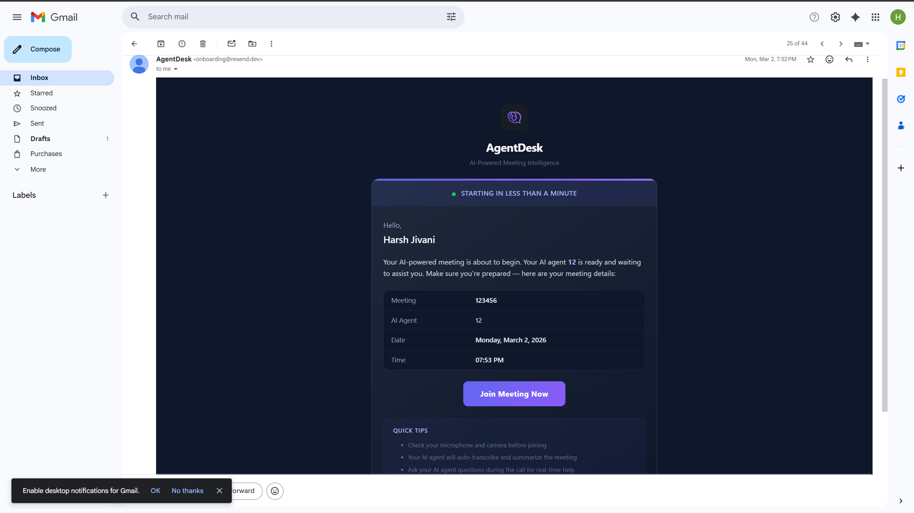
*User will receive one email as a reminder if the meeting is scheduled for the future.*

---

## 🔄 Background Jobs (Inngest)

### Job: Meeting Transcription & Summarization

**Trigger**: Meeting ends (`meetings/ended`)  
**Status transition**: `completed` -> `processing` -> `completed`

**Steps**:
1. Fetch meeting recording and transcript from Stream.io.
2. Send audio to OpenAI Whisper for transcription.
3. Process transcript through OpenAI GPT models.
4. Generate structured summary with:
   - General overview section
   - Key notes with timestamps
   - Slide references and mapping
   - Action items
5. Store transcript and summary files/entries in the database.
6. Update meeting status to "completed".
7. Send notification email to the user.

**Configuration**:
```typescript
export const handleMeetingEnd = inngest.createFunction(
  { id: "handle-meeting-end" },
  { event: "meetings/ended" },
  async ({ event, step }) => {
    // Job implementation
  }
);
```

**End-to-End UserFlow**:
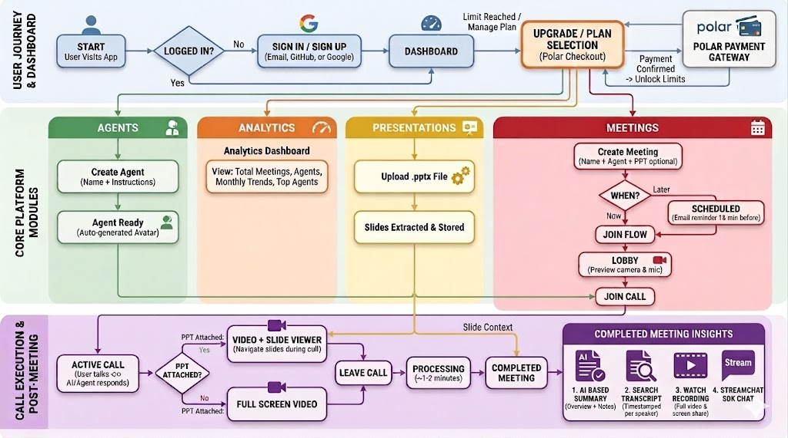

---

## 🤝 Contributing

We welcome contributions! Please follow these guidelines:

### Development Workflow

1. **Create a feature branch**
   ```bash
   git checkout -b feature/my-feature
   ```

2. **Make your changes**
   - Follow code style conventions
   - Add tests for new functionality
   - Update documentation as needed

3. **Test locally**
   ```bash
   npm run test
   npm run lint
   ```

4. **Commit with clear messages**
   ```bash
   git commit -m "feat: add new feature description"
   ```

5. **Push and create Pull Request**
   ```bash
   git push origin feature/my-feature
   ```

### Branch Naming Conventions
- `feature/*` - New features
- `bugfix/*` - Bug fixes
- `docs/*` - Documentation
- `refactor/*` - Code refactoring

### Commit Message Format
```
<type>(<scope>): <subject>

<body>

<footer>
```

Types: `feat`, `fix`, `docs`, `style`, `refactor`, `test`, `chore`

---

## 📝 License

This project is licensed under the MIT License - see the [LICENSE](file:///e:/agentdesk/LICENSE) file for details.

---

## 📞 Support & Contact

- **Issues**: [GitHub Issues](https://github.com/yourusername/agentdesk/issues)
- **Discussions**: [GitHub Discussions](https://github.com/yourusername/agentdesk/discussions)
- **Email**: support@agentdesk.dev
- **Documentation**: [Full Docs](https://docs.agentdesk.dev)

---

## 🙏 Acknowledgments

- [Stream.io](https://getstream.io/) - Real-time communication infrastructure
- [OpenAI](https://openai.com/) - AI and language models
- [Shadcn/ui](https://ui.shadcn.com/) - Component library
- [Drizzle ORM](https://orm.drizzle.team/) - Type-safe ORM
- [Inngest](https://www.inngest.com/) - Background job processing
- All our contributors and users!

---

**Last Updated**: May 2026  
**Version**: 0.1.0  
**Status**: Active Development
