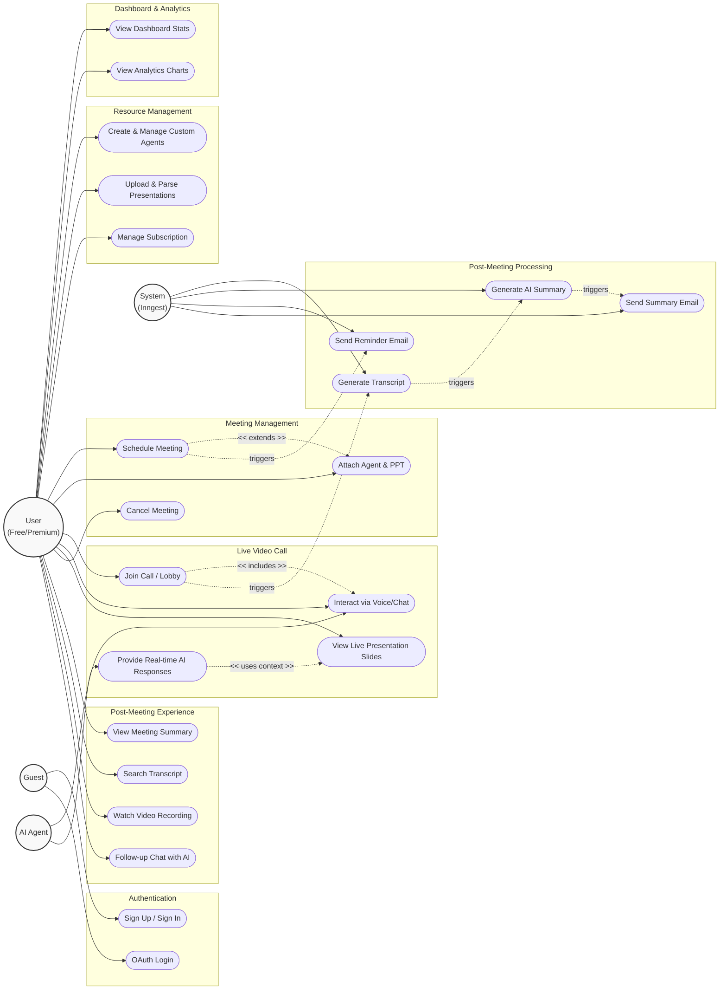

# Meet AI - Use Case Diagram

This document outlines the core use cases and actors for the **Meet AI** platform.

## Actors

- **Guest**: An unauthenticated user visiting the landing page.
- **User (Free)**: An authenticated user on the free tier (has limits on agents, presentations, and meetings).
- **User (Premium)**: An authenticated user with an active Polar subscription (higher or unlimited quotas).
- **AI Agent**: The virtual participant in the meeting, powered by OpenAI. It interacts in real-time and has context of uploaded slides.
- **System (Inngest / Webhooks)**: The background worker system responsible for triggered tasks (reminders, summarization).

## Use Case Diagram

## Description of Key Workflows

### 1. Pre-Meeting (Preparation)
Users start by logging in, creating personalized AI agents with specific instructions, and uploading PowerPoint (`.pptx`) presentations. These resources are counted against their active subscription plan limits. The user then schedules a meeting, selecting their preferred AI agent and optionally attaching a presentation.

### 2. Live Meeting (Execution)
The user enters the Stream-powered video lobby and joins the call. The AI Agent automatically joins as a participant. If a presentation was attached, the user can navigate through the slides via a side-by-side view. The user and AI agent communicate via voice and chat. When the user asks a question, the AI uses the current slide's context (if available) or its general knowledge to respond intelligently.

### 3. Post-Meeting (Processing & Review)
When the call ends, the System processes the meeting. It extracts the conversation transcript, attributes speakers, and uses GPT-4o-mini to generate a detailed summary containing an overview, notes, and specific slide references. The system then emails this summary to the user. Later, the user can review the summary, search the full transcript, watch the recording, and chat with the AI for any follow-up questions.
